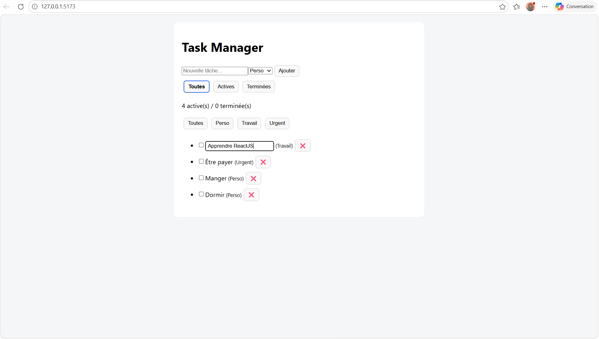

# Task Manager

Application de gestion de tâches réalisée avec React + Vite.

## Fonctionnalités

- Ajouter une tâche
- Supprimer une tâche
- Modifier une tâche
- Marquer une tâche comme terminée
- Filtres :
  - Toutes
  - Actives
  - Terminées
- Catégories :
  - Perso
  - Travail
  - Urgent
- Sauvegarde automatique avec localStorage

## Technologies utilisées

- React
- JavaScript
- CSS
- Vite

## Screenshot

